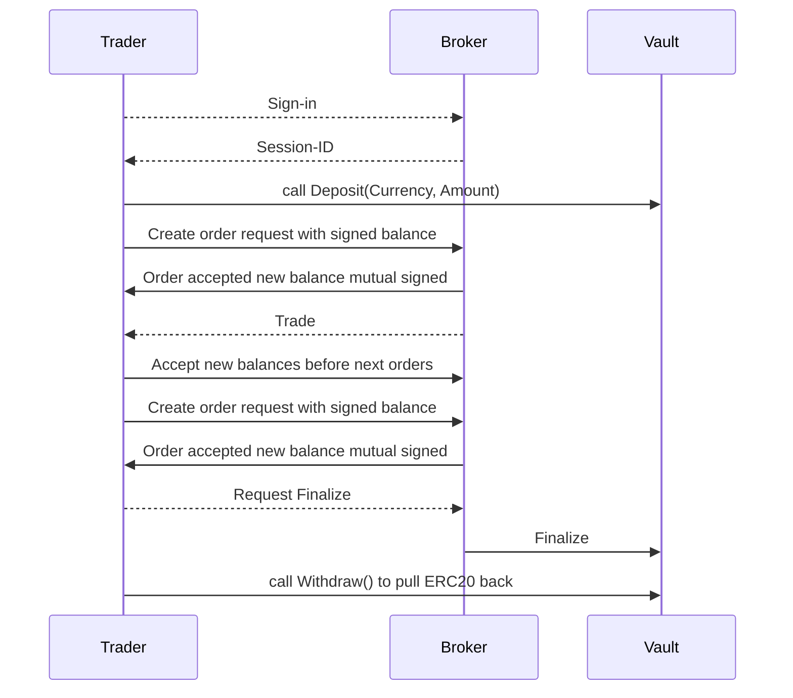

---
tags:
  - Open Finance
  - Trading channels
---

# Trading channels

Trading channels are a specific implementation of state channels specifically designed for trading purposes. State channels are a technique for scaling blockchains by running most of the process off-chain and committing only the result to the blockchain. Every trading step is an off-chain transition from a state to an other, transitions are performed between the trader (client) and the broker (server). Each party sign each transition at every step. If both parties sign the final step, any of them can use this final state to withdraw the funds of the final balance.

## Definitions

**Vault**: smart-contract dedicated to a broker, it’s possible a broker has more than one vault per network, which implement [NitroAdjudicator](https://github.com/statechannels/statechannels/blob/master/packages/nitro-protocol/contracts/NitroAdjudicator.sol)

**Channel**: is trading balance allocated from blockchain state, having a life-cycle of the backend session, likely expires after 30 min of inactivity (no new orders)
Opening a channel occurs after the funding stage (deposit fund to smart-contract), closing the channel, update available balance which can be withdrawn at the defunding stage.

Channel-ID is likely mapped to Server side Session-ID

**Adjudicator:** logic in smart-contract to validate a state transition, in our case transitions are balance chance having the following transition logic: If user initiate balance change, with mutually signed by user and broker (deposit, order, cancel)If broker initiate balance change, it’s only signed by broker and user can’t reject the transition, (ex: new trades) within range of possible operations, such as executing open order.

**State**:
The minimal state is defined as available balance, locked balance.


## Protocol overview

In this approach we leave the initiative of messages to the server, the client only acknowledge the messages. This way the server can immediately send trade notifications to the client. *Create Order* and *Finalize* requests are made by the client outside of the state channel protocol which brings the benefit of having the server to accept the order before the state is changed.





## State format

```c
struct FixedPart {
  uint256 chainId;
  address[] participants;
  uint48 channelNonce;
  address appDefinition;
  uint48 challengeDuration;
}
```

```c
struct VariablePart {
  bytes outcome;
  bytes appData;
}
```

### State appData

```json
{
	0x0: [0.10, 0.20], // Native chain token (ETH, MATIC, BNB, ...), [available, locked]
    0xa0b86991c6218b36c1d19d4a2e9eb0ce3606eb48: [1000, 2000] // USDC token address on ETH
}
```


### Increment

This number has to be incremented by one when a party issue a new state, by signing a new state the party implicitly validates the previous state issued by the other party.

### Balances

Balances define the current available funds available for trading, the user might be able to limit the amount of funds he wants to allocate to the current trading session.

We can probably store only the available balances, so when an order is created we reduce the amount of available balance according to this order (by the "locked" amount). :building_construction:

### Open orders

List of current open orders of the trader, the trader updates this list when he creates an order and the server when there is a trade.

### Outcomes

Represent the amount to be paid at the end of the trading session by the trader to the broker and the other way around.

Those outcomes can be used at some point for further trading, a trader could decide to buy a token at the beginning of the session and sell before the end the session, in this case the outcomes of the session would be the profits or losses.

## Native Multi-Blockchains support

The trading channel protocol is intended to be used over multiple blockchains. The trader can lock funds on one blockchains and request payment of the outcomes on an other one.

https://besu.hyperledger.org/en/stable/Concepts/NetworkID-And-ChainID/

We aim to support more than Ethereum layer 1 & 2 networks, so we can't just use Chain ID and Network ID which are defined only for EVM based blockchains.

The [EIP-3220](https://eips.ethereum.org/EIPS/eip-3220) can be used to define a unique identifier for every blockchain.


## Disputes
