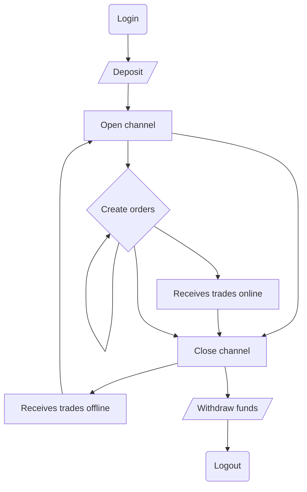

---
tags:
  - State Channels
  - Trading channels
  - Custody
  - Blockchain
  - web3
---

# Trading channels

## Introduction

Trading channels are a specific implementation of state channels specifically designed for trading purposes. State channels are a technique for scaling blockchains by running most of the process off-chain and committing only the result to the blockchain. Every trading step is an off-chain transition from a state to another, transitions are performed between the trader (client) and the broker (server). Each party signs each transition at every step. If both parties sign the final step, any of them can use this final state to withdraw the funds of the final balance.

## Definitions

**Vault**: smart-contract dedicated to a broker, it’s possible a broker has more than one vault per network, which implements [NitroAdjudicator](https://github.com/statechannels/statechannels/blob/master/packages/nitro-protocol/contracts/NitroAdjudicator.sol).

**Channel**: trading balance allocated from blockchain state, having a life-cycle of the backend session, likely expires after 30 min of inactivity (no new orders). Opening a channel occurs when deposited to the smart contract funds get locked. Closing a channel forces the balance update, and funds can be withdrawn. 

The Channel-ID is likely mapped to the Server-side Session-ID.

**Adjudicator**: logic in a smart contract to validate a state transition. In our case, transitions are balance changes with the following transition logic:
- If a user initiates the balance change, it gets executed mutually signed by the user and broker depositing, creating an order, canceling an order)
- If a broker initiates the balance change, it’s only signed by the broker and the user can’t reject the transition (making a new trade) within the range of possible operations, such as executing an open order


**State**:
The channel State reflects status of all balances. The simliest state consists of available balance plus locked balance.

## Protocol overview

In this approach we leave the initiative of messages to the server, the client only acknowledges the messages. This way the server can immediately send trade notifications to the client. The client makes *Create Order* and *Finalize* requests outside the state protocol. Thus, the server accepts the order before the state changes.


## State format

```c
struct FixedPart {
  uint256 chainId;
  address[] participants;
  uint48 channelNonce;
  address appDefinition;
  uint48 challengeDuration;
}
```

```c
struct VariablePart {
  bytes outcome;
  bytes appData;
}
```

### State appData

```json
{
	0x0: [0.10, 0.20], // Native chain token (ETH, MATIC, BNB, ...), [available, locked]
    0xa0b86991c6218b36c1d19d4a2e9eb0ce3606eb48: [1000, 2000] // USDC token address on ETH
}
```

#### Balances

Balances define the current funds available for trading. The user can limit the amount of funds they want to allocate to the current trading session.

| :exclamation:  Important note about balance states and trades |
| ------------------------------------------------------------ |
| The main goal of the state channel is to keep track of open orders, and therefore to know the available balance when a withdrawal request arrives. Since trades are not initiated directly by the trader request and depend on an external context such as price change, the protocol DOES NOT request end-user signatures on trades. Thus, trades cannot be rejected by the trader. Though, the trader will have an updated balance from a valid transition which MUST be connected to a previously locked balance and an opened order. When resuming trade activity, the user must accept their new state before submitting more orders. |

#### Channels

Channels have a short lifespan matching the online and connected presence of the trader, or a bot. They match and belong to server-side session duration, when the server-side session expires, the backend executes *ForceMove* to finalize the state of the channel and save it in the blockchain.
Additionally, when the trader closes their session gracefully by clicking the logout button, they request if they wish to persist the state into the Vault.


## State Machine




### Crosschains support

The trading channel protocol is intended to be used over multiple blockchains. The trader can lock funds on one blockchain and request payment of the outcomes on another one. 
[See NetworkID And ChainID.](https://besu.hyperledger.org/en/stable/Concepts/NetworkID-And-ChainID/)

Open-Finance aims to support more than Ethereum layer 1 & 2 networks, so we can't just use Chain ID and Network ID, which are defined only for EVM-based blockchains.

The [EIP-3220](https://eips.ethereum.org/EIPS/eip-3220) can be used to define a unique identifier for every blockchain.

## Adjudicator logic

### Balance valid transitions

1. A trader can only update the main balance to locked balance in the limit of amount initiated in the channel and previously deposited (by creating orders)
2. A trader can unlock funds from locked to main balance by canceling orders
3. A broker can swap locked balance funds from one to another currency when trades occur


### Open order count valid transitions

1. A trader can increment open orders count by creating orders
2. A trader can decrement open orders count by canceling orders
3. A broker can decrement open orders count by fulfilling orders
4. A broker cannot update balance without open orders
