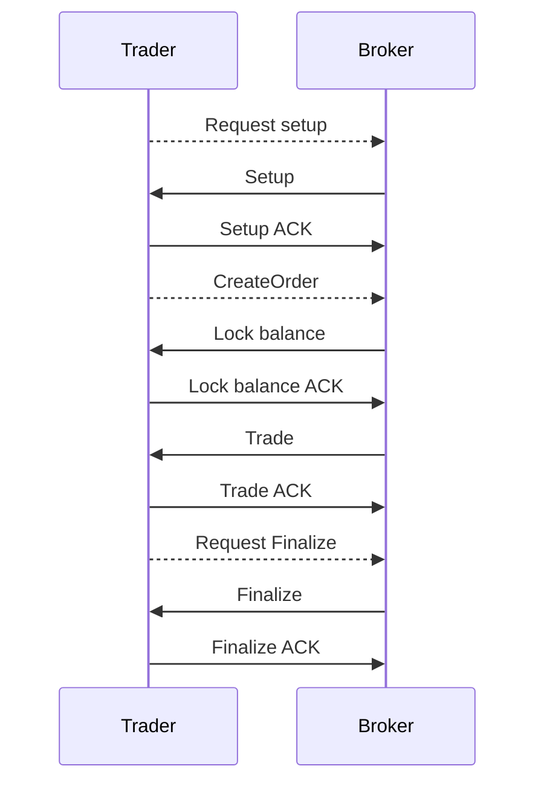
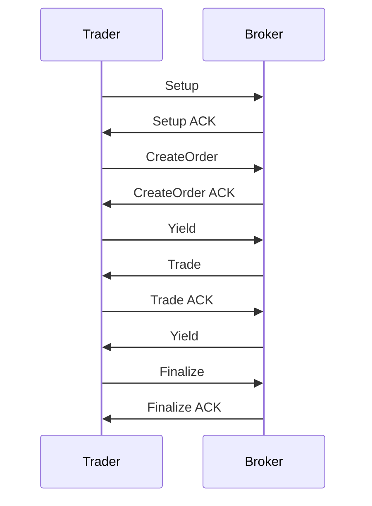

---
tags:
  - Open Finance
  - Trading channels
---

# Trading channels

Trading channels are a specific implementation of state channels specifically designed for trading purposes. State channels are a technique for scaling blockchains by running most of the process off-chain and committing only the result to the blockchain. Every trading step is an off-chain transition from a state to an other, transitions are performed between the trader (client) and the broker (server). Each party sign each transition at every step. If both parties sign the final step, any of them can use this final state to withdraw the funds of the final balance.


## Simple Example (server initiative)




## Simple Example (cooperative approach)





## State format

A state is a simple arrayEvery event is formatted in a JSON array like the following:

```
[increment, balances, open_orders, outcomes]
```


| Element    | Description                                                  |
| ---------- | ------------------------------------------------------------ |
| increment       | Number incrementing at every turn |
| balances | Available and locked balances of the trader |
| open_orders     | List of open orders of the trader |
| outcomes  | Result of the current outcomes for the trader and broker for this session |


## Disputes

