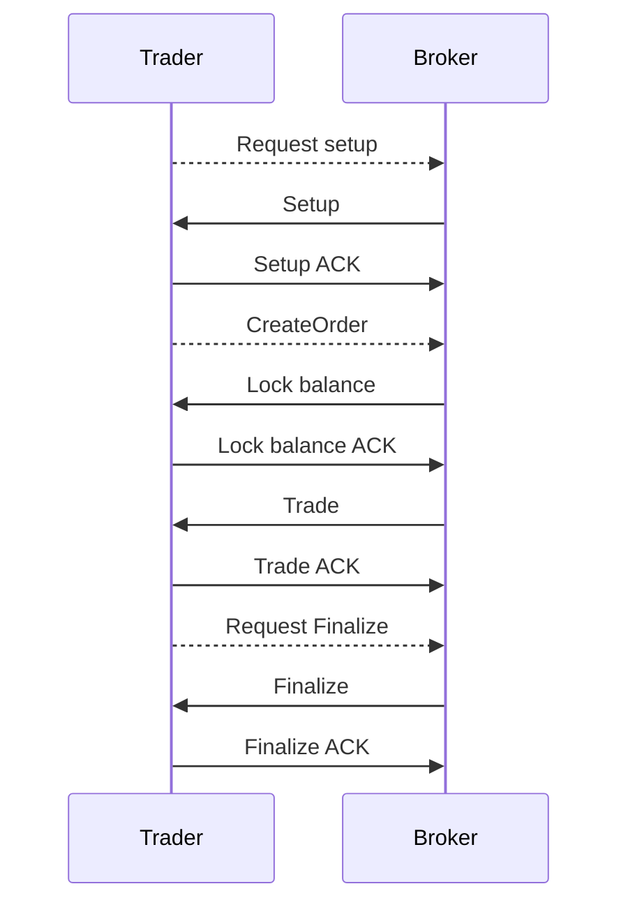
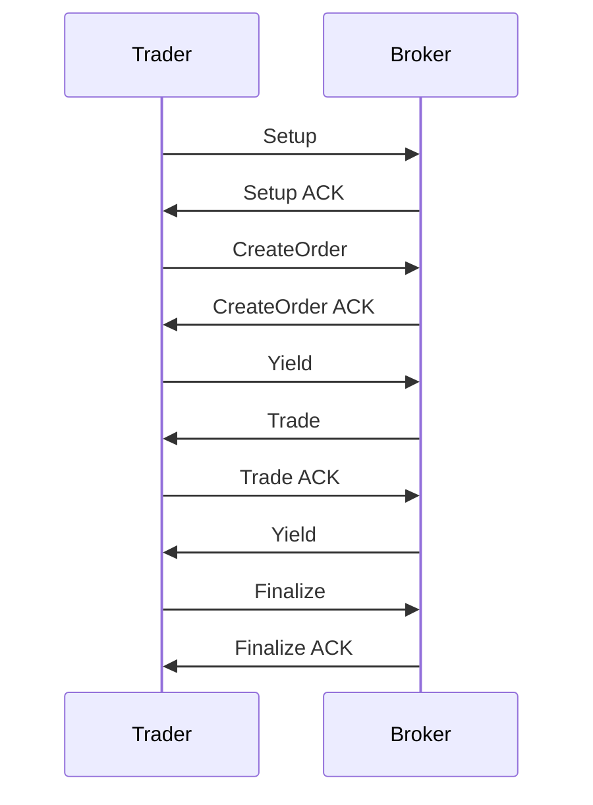

---
tags:
  - Open Finance
  - Trading channels
---

# Trading channels

Trading channels are a specific implementation of state channels specifically designed for trading purposes. State channels are a technique for scaling blockchains by running most of the process off-chain and committing only the result to the blockchain. Every trading step is an off-chain transition from a state to an other, transitions are performed between the trader (client) and the broker (server). Each party sign each transition at every step. If both parties sign the final step, any of them can use this final state to withdraw the funds of the final balance.


## Simple Example (server initiative)




## Simple Example (cooperative approach)





## State format

A state is a simple array containing the following elements:

```
[increment, balances, open_orders, outcomes]
```


| Element    | Description                                                  |
| ---------- | ------------------------------------------------------------ |
| increment       | Number incrementing at every turn |
| balances | Available and locked balances of the trader |
| open_orders     | List of open orders of the trader |
| outcomes  | Result of the current outcomes for the trader and broker for this session |

### Increment

This number has to be incremented by one when a party issue a new state, by signing a new state the party implicitly validates the previous state issued by the other party.

### Balances

Balances define the current available funds available for trading, the user might be able to limit the amount of funds he wants to allocate to the current trading session.

:construction: We can probably store only the available balances, so when an order is created we reduce the amount of available balance according to this order (by the "locked" amount).:construction:

### Open orders

List of current open orders of the trader, the trader updates this list when he creates an order and the server when there is a trade.

### Outcomes

Represent the amount to be paid at the end of the trading session by the trader to the broker and the other way around.

Those outcomes can be used at some point for further trading, a trader could decide to buy a token at the beginning of the session and sell before the end the session, in this case the outcomes of the session would be the profits or losses.

## Disputes

To be defined.