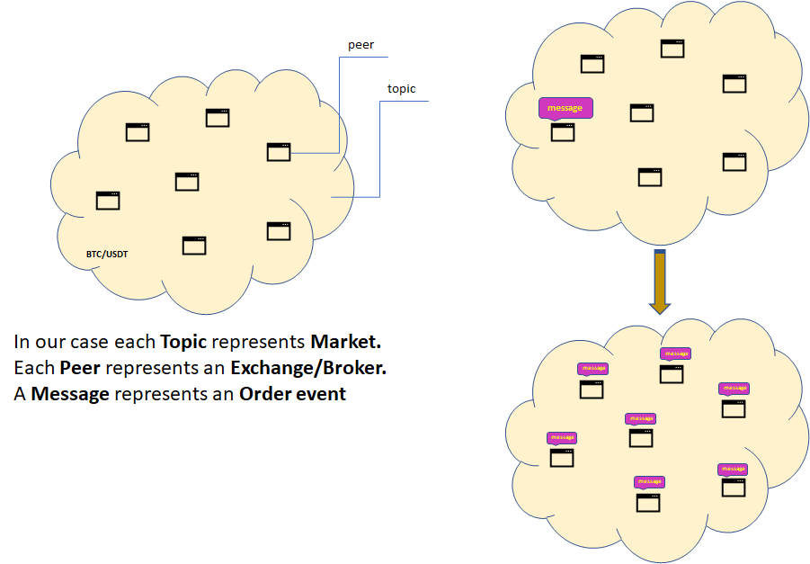
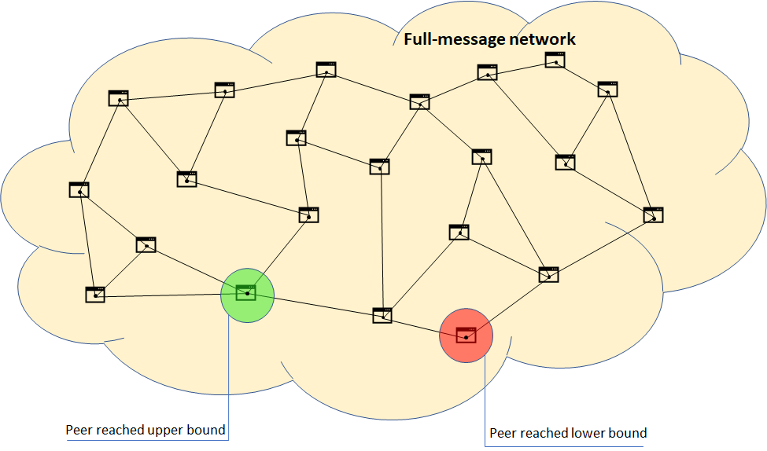
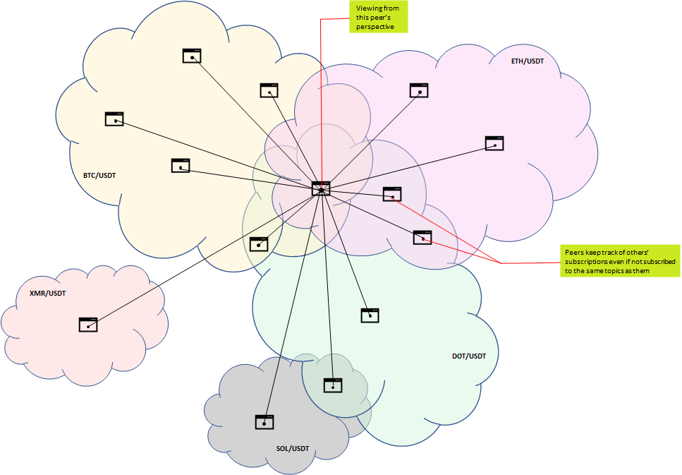
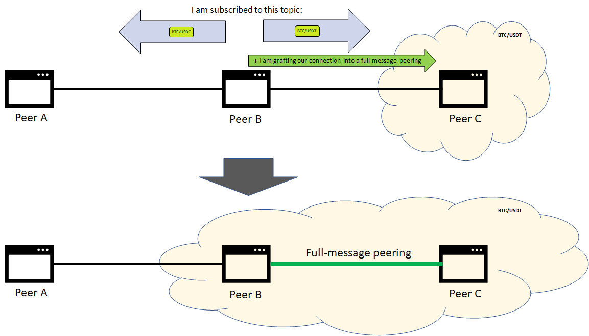
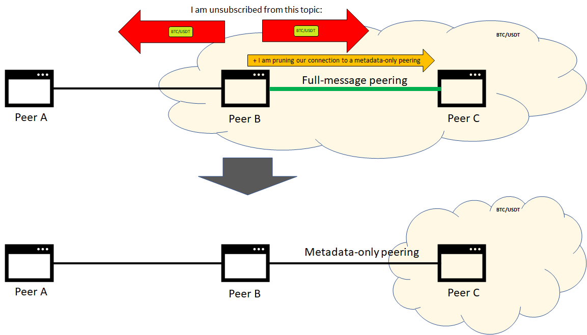
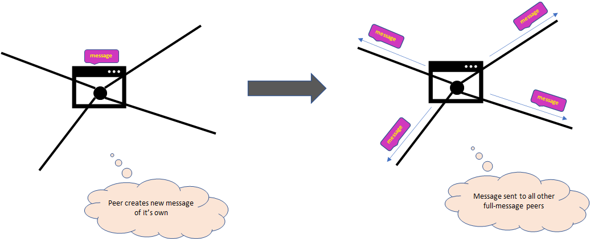
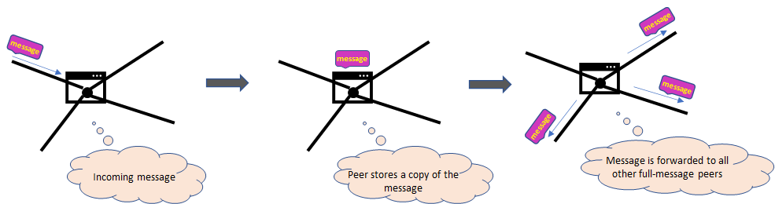
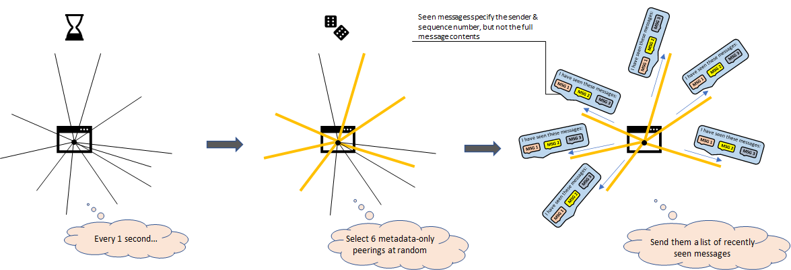

---
tags:
  - lib2p2
  - Discovery
  - Subscribing
  - Peering
  - Message
  - Gossip
---

# Peer-to-peer protocol

## lib2p2

Publish/Subscribe is a system where peers congregate around topics they are interested in. Each topic in our case represent a separate market (e.g. “BTC/USDT”). Peers interested in a topic are said to be subscribed to that topic. Peers can send messages to topics. Each message gets delivered to all peers subscribed to the topic:

## Design goals

In a peer-to-peer pub/sub system all peers participate in delivering messages throughout the network. There are several different designs for peer-to-peer pub/sub systems which offer different trade-offs. Desirable properties include:
- Reliability: All messages get delivered to all peers subscribed to the topic.

- **Speed:** Messages are delivered quickly.
- **Efficiency:** The network is not flooded with excess copies of messages.
- **Resilience:** Peers can join and leave the network without disrupting it. There is no central point of failure.
- **Scale:** Topics can have enormous numbers of subscribers and handle a large throughput of messages.
- **Simplicity:** The system is simple to understand and implement. Each peer only needs to remember a small amount of state.

Libp2p currently uses a design called **gossipsub**. It is named after the fact that peers gossip to each other about which messages they have seen and use this information to maintain a message delivery network.

## Discovery

Before a peer can subscribe to a topic it must find other peers and establish network connections with them. The pub/sub system doesn’t have any way to discover peers by itself. Instead, it relies upon the application to find new peers on its behalf, a process called **ambient peer discovery**.

Potential methods for discovering peers include:

- distributed hash tables;
- local network broadcasts;
- exchanging peer lists with existing peers;
- centralized trackers or rendezvous points;
- lists of bootstrap peers.

Discovered peers are asked if they support the pub/sub protocol, and if so, are added to the pub/sub network.

### Bootstrap

Each bootstrap must have the following format:
  /ip4/*ip*/tcp/*port*/p2p/*node_id*

For example:
  /ip4/104.131.131.82/tcp/4001/p2p/QmaCpDMGvV2BGHeYERUEnRQAwe3N8SzbUtfsmvsqQLuvuJ

### Rendezvous

Depending on the application, the protocol could be used in the following context:
- During bootstrap, a node can use known rendezvous points to discover peers that provide critical services. For instance, rendezvous can be used to discover circuit relays for connectivity restricted nodes.
- During initialization, a node can use rendezvous to discover peers to connect with the rest of the application. For instance, rendezvous can be used to discover pubsub peers within a topic.
- In a real time setting, applications can poll rendezvous points in order to discover new peers in a timely fashion.
- In an application specific routing setting, rendezvous points can be used to progressively discover peers that can answer specific queries or host shards of content.

Rendezvous can be naturally combined with pubsub for effective real-time discovery. At a basic level, rendezvous can be used to bootstrap pubsub: nodes can utilise rendezvous in order to discover their peers within a topic. Alternatively, pubsub can also be used as a mechanism for building rendezvous services. In this scenerio, a number of rendezvous points can federate using pubsub for internal real-time distribution, while still providing a simple interface to clients.

## Types of peering

In gossipsub, peers connect to each other via either **full-message peerings** or metadata-only peerings.

Full-message peerings are used to transmit the full contents of messages throughout the network. This network is sparsely-connected with each peer only being connected to a few other peers. 

Limiting the number of full-message peerings is useful because it keeps the amount of network traffic under control; each peer only forwards messages to a few other peers, rather than all of them. Each peer has a target number of peers it wants to be connected to. In this example each peer would ideally like to be connected to 3 other peers, but would settle for 2–4 connections:

## Peer IDs and Keys

libp2p uses cryptographic key pairs to **sign messages and derive unique peer identities** (or "peer ids").

#### What are the keys used?
Keys are used in two places in libp2p. The first is for signing messages. Here are some examples of messages that could be signed this way:
- IPNS records
- PubSub messages
- SECIO handshake
The second is for generating peer ids; this is discussed in the section below.

#### Key types
Four key types are supported:
-RSA
-Ed25519
-Secp256k1
-ECDSA
We must use Ed25519 keys since they’re supported by all nodes while RSA and ECDSA may not be accepted by some nodes.

## Subscribing and unsubscribing

Peers keep track of which topics their directly-connected peers are subscribed to. Using this information each peer is able to build up a picture of the topics around them and which peers are subscribed to each topic:

Keeping track of subscriptions happens by sending **subscribe** and **unsubscribe** messages. When a new connection is established between two peers they start by sending each other the list of topics they are subscribed to:

  

Then over time, whenever a peer subscribes or unsubscribes from a topic, it will send each of its peers a subscribe or unsubscribe message. These messages are sent to all connected peers regardless of whether the receiving peer is subscribed to the topic in question:

  

Subscribe and unsubscribe messages go hand-in-hand with graft and prune messages. When a peer subscribes to a topic it will pick some peers that will become its full-message peers for that topic and send them graft messages at the same time as their subscribe messages:

When a peer unsubscribes from a topic it will notify its full-message peers that their connection has been pruned at the same time as sending their unsubscribe messages:

## Sending messages

When a peer wants to publish a message it sends a copy to all full-message peers it is connected to:

Similarly, when a peer receives a new message from another peer, it stores the message and forwards a copy to all other full-message peers it is connected to:

Peers are also known as **routers** because of this function they have in routing messages through the network.

Peers remember a list of recently seen messages. This lets peers act upon a message only the first time they see it and ignore retransmissions of already seen messages.

Peers might also choose to validate the contents of each message received. What counts as valid and invalid depends on the internal logic described further.

#### Kademlia routing
kad-routing implements the Kademlia Routing table, where each peer holds a set of k-buckets, each of them containing several PeerInfo objects from other peers in the network

## Gossip

Peers gossip about messages they have recently seen. Every 1 second each peer randomly selects 6 metadata-only peers and sends them a list of recently seen messages.

Gossiping gives peers a chance to notice in case they missed a message on the full-message network. If a peer notices it is repeatedly missing messages then it can set up new full-message peerings with peers that do have the messages. A specific message can be requested across a metadata-only peering this way:

  

  

  

  

  

  

Gossip announcing recently seen messages are called **IHAVE** messages and requests for specific messages are called **IWANT** messages.

### Flow of the Order sharing to the Topic (Network) Orderbook
<Mermaid chart='
sequenceDiagram
Peer A--> Topic Orderbook: connect
Topic Orderbook--> Peer B: connect
User A->> Peer A: Create order
Note over User A,Peer A: Order gets peer_ID
Peer A->> Peer A: update of the local Orderbook of Peer A
Peer A->> Topic Orderbook: Push order
Note over Peer A, Topic Orderbook: Order with peer_ID of Peer A
Topic Orderbook->> Peer B: Gossip
Note over Peer B: at this point Peer B has a local order to be matched
Peer B->> Peer B: Order execution
Peer B->> Topic Orderbook: Event
Note over Peer B, Topic Orderbook: the state of the order is changed
Topic Orderbook->> Peer A: Full Connection/Gossip
Peer A->> Peer A: update of the local Orderbook of Peer A' />

### Flow of the getting a snapshot
<Mermaid chart='
sequenceDiagram
Peer A->> Bootstrap: Connect
Bootstrap ->> Bootstrap: Update local DHT
Peer A->> Network: Advertise (via Rendezvous string)
Network->> Peer A: Share matched rendezvous Peers (N total)
Peer A->> Peer X1: RPC call
Peer X1-->> Peer A: 
Peer A->> Peer X2: RPC call
Peer X2-->> Peer A:  
Peer A->> Peer XZ: RPC call
Peer XZ-->> Peer A: 
Note over Peer A, Peer XZ: RPC calls are made to random Peers (among N) according to Round Robin Algorithm, with total amount of RPC calls: Z=N/3
Peer A->> Peer A: Merge results' />

### Flow of the initial Peer connect
<Mermaid chart='
sequenceDiagram
Peer A->> Peer A: local Orderbook
Peer A->> Bootstrap: Connect
Bootstrap ->> Bootstrap: Update local hash table
Note over Bootstrap, Network: at this point Network knows about Peer A
Peer A->> Network: Advertise (via Rendezvous string)
Network->> Peer A: Reply with Array of Peers for this Topic
Note over Network, Peer A: [Peer X, Peer Y, Peer Z...]
Peer A->> Peer X: Snapshot request
Peer X->> Peer A: Snapshot
Peer A->> Peer A: local Orders matching' />

## Expected flow

*Note: this is an early understanding of the flow, it is expected to be changed the moment we start the next Sprint*

1. Peer starts
- Load order from DB
- Peer Receives unique **Peer_id** (key is preset) that should not change with the peer stop/start
2. Peer establishes connection to a bootstrap node 
- The bootstrap node should register newly connected Peer
- Peer subscribes to the rendezvous topic
3. Peer subscribed to topic (sync order book)
- Peer emit local order on the topic to the connected Peer(2)
- //***Peer(2) now can produce trade related to order from initial Peer***
- Peer requests a snapshot of the topic order book from connected Peer(2) via RPC
- //*Peer stores received network orders*
- //***At this point trade local - network could happen on initial Peer***
4. The peer can receive next messages on the topic
- Snapshot request via RPC
- New network order received (state wait)
- Old network order update
- //*Remove order (state done)*
- //*(Remaining volume update is scoped out, no partial match for now)*
- The **message** that indicates that local order of our Peer is matched on another Peer, for now, is scoped out
- One of topics Peers dies, the **message** which indicates that order from that Peer have to be removed
5. The peer can emit next messages on the topic:
- Snapshot via RPC
- New local order created  (to become a network order  with state wait)
- Old order update
- //*Remove order (Order state update to done)*
- New Local - Network trade created
- //*local order removed (state changed to done)*
- //*network order removed (state changed to done)*

##### Question
How a liability is created if Local order is matched with Network order?

We don't have the funds locked in network order to create a local liability and give the user his funds.