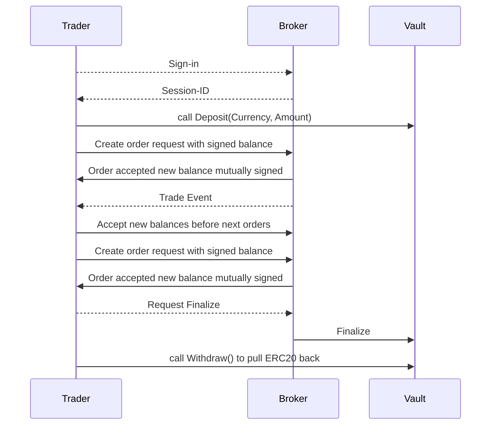
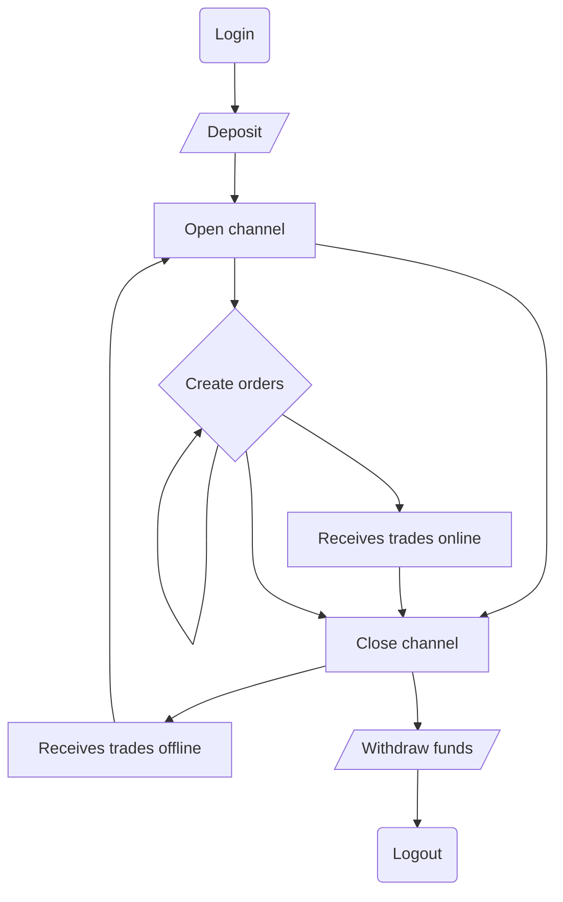

---
tags:
  - State Channels
  - Trading channels
  - Custody
  - Blockchain
  - web3
---

# Trading channels

## Introduction

Trading channels are a specific implementation of state channels specifically designed for trading purposes. State channels are a technique for scaling blockchains by running most of the process off-chain and committing only the result to the blockchain. Every trading step is an off-chain transition from a state to an other, transitions are performed between the trader (client) and the broker (server). Each party sign each transition at every step. If both parties sign the final step, any of them can use this final state to withdraw the funds of final balances.

## Definitions

**Vault**: smart-contract dedicated to a broker, it’s possible a broker has more than one vault per network, which implement [NitroAdjudicator](https://github.com/statechannels/statechannels/blob/master/packages/nitro-protocol/contracts/NitroAdjudicator.sol)

**Channel**: contains trading balances allocated from a blockchain state, it has a life-cycle of the backend session, likely expires after 30 min of inactivity (no new orders). Opening a channel occurs after the funding stage (deposit fund to smart-contract), closing the channel, update available balance which can be withdrawn at the defunding stage.

Channel-ID is likely mapped to Server side Session-ID

**Adjudicator:** logic in smart-contract to validate a state transition, in our case transitions are balance change having the following transition logic: If user initiate balance change, with mutually signed by user and broker (deposit, order, cancel). If broker initiate balance change, it’s only signed by broker and user can’t reject the transition, (ex: new trades) within range of possible operations, such as executing open order.

**State**:
The minimal state is defined as available balance, locked balance.

## Protocol overview

In this approach we leave the initiative of messages to the server, the client only acknowledge the messages. This way the server can immediately send trade notifications to the client. *Create Order* and *Finalize* requests are made by the client outside of the state channel protocol which brings the benefit of having the server to accept the order before the state is changed.





## State format

```c
struct FixedPart {
  uint256 chainId;
  address[] participants;
  uint48 channelNonce;
  address appDefinition;
  uint48 challengeDuration;
}
```

```c
struct VariablePart {
  bytes outcome;
  bytes appData;
}
```

### State appData

```json
{
	0x0: [0.10, 0.20], // Native chain token (ETH, MATIC, BNB, ...), [available, locked]
    0xa0b86991c6218b36c1d19d4a2e9eb0ce3606eb48: [1000, 2000] // USDC token address on ETH
}
```

#### Balances

Balances define the current funds available for trading, the user might be able to limit the amount of funds he wants to allocate to the current trading session.

| :exclamation:  Important note about balance states and trades |
| ------------------------------------------------------------ |
| The main goal of the state-channel is to keep track of open orders to know the available balance when requesting a withdrawal. Since trades are not initiated directly by the trader request and depends on an external context such as a price change, the protocol DOES NOT request end-user signature on trades. Thus trades cannot be rejected by the trader. Though the trader will have an updated balance from a valid transition which MUST be connected to a previously locked balance and an open order, when resuming trade activity user must accept his new state before submitting more orders. |

#### Channels

Channels have a short lifespan depending on the online and connected presence of the trader or bot. They match and belong to server side session duration, when a server side session expires, backend can *ForceMove* to finalize the state of the channel and persist to the blockchain.

Additionally when trader closed gracefully his session by clicking the logout button, he is requested if he wish to persist the state onto the Vault.

## State Machine




### Crosschains support

The trading channel protocol is intended to be used over multiple blockchains. The trader can lock funds on one blockchains and request payment of the outcomes on an other one.

Open-Finance aims to support more than Ethereum layer 1 & 2 networks (EVM based blockchains), EVM based blockchains use [Chain ID and Network ID](https://besu.hyperledger.org/en/stable/Concepts/NetworkID-And-ChainID/) to identify the blockchains, thus it's not compatible with blockchains not based on EVM.

The [EIP-3220](https://eips.ethereum.org/EIPS/eip-3220) can be used to define a unique identifier for every blockchain.

## Adjudicator logic

### Balance valid transitions

1. Trader can only update main balance to locked balance in the limit of amount initiated in channel and previously deposited (By creating orders)
2. Trader can unlock funds from locked to main balance by canceling orders
3. Broker can swap locked balance funds from and to another currency when trades occurs

### Open order count valid transitions

1. Trader can increment open order count by creating orders
2. Trader can decrement open order count by canceling orders
3. Broker can decrement open order count by fulfilling orders
4. Broker cannot update balance without open orders
