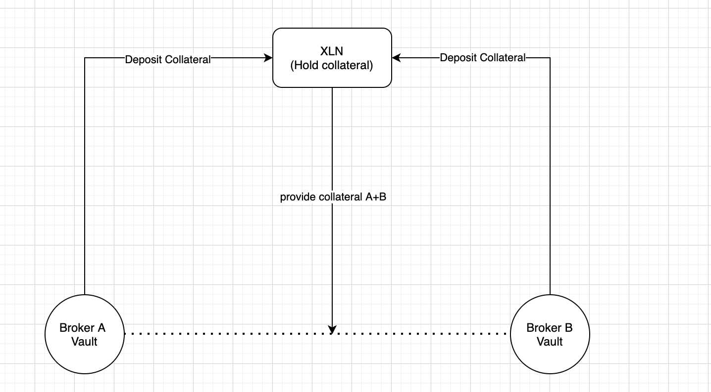

---
tags:
  - State Channels
  - Custody
  - Blockchain
  - web3
---

# Broker to Broker state channels

## Smart Contracts Architecture

We still need to define the approach for custody smart contract architecture

|                                                        | Pros                                                         | Cons                                                         |
| ------------------------------------------------------ | ------------------------------------------------------------ | ------------------------------------------------------------ |
| Single smart contract                                  | - Simplify the deployment of a broker (no SM to deploy)<br />- No external transfer for brokers settlement (save gas?)<br />- Big TVL for XLN network<br />- User doesn't need to allow spending on every broker<br />- Broker doesn't need to deposit collateral, they can use user funds directly | - Might be a SPOF<br />- Complex smart contract<br />        |
| One smart contract per broker, one for XLN collateral  | - Simple smart contract<br />- Easy to inspect broker funds<br />- Broker can govern his smart contract | - Broker can exit scam<br />- Broker is responsible of securing the governance |
| One smart contract per broker, none for XLN collateral | - Broker doesn't need to deposit collateral                  | - XLN has access to brokers funds                            |


### Single smart contract

Only one smart contract would be used for the whole network. For deploying a new broker Openware will just have to register to the start contract this new broker (public key, public url).

In this case the collateral need is a lot less necessary, since all funds are already sitting on the smart contract, we just need to evaluate the risk of dispute. The broker would need to cover the cost of lost dispute (penalty).

### One smart contract per broker, one for XLN collateral  

Each broker would have his own smart contract.

### One smart contract per broker, none for XLN collateral  


## General overview

B2B state channels are specific, each broker smart contract is involved in a transaction, also XLN is used to lock the value of the trade from brokers collaterals and manage disputes.




## Sequences

### State channel initialization sequence

```sequence
Broker A-->>XLN: Request a collateral lock
XLN-->>Broker A: Provide a signed lock
Broker A->>Broker B: Initiate the state channel with lock A
Broker B-->>XLN: Request a collateral lock
XLN-->>Broker B: Provide a signed lock
Broker B->>Broker A: Add lock B
```

### Trading sequence

```sequence
Broker A->Broker B: Create matching order
Broker B->Broker A: Match order (update balance)
```


### Happy ending sequence

```sequence
Broker A->Broker B: Request final state signature
Broker B->Broker A: Sign final state
```

- Broker A use the final signed state to withdraw funds from Broker B smart contract
- Broker B use the final signed state to withdraw funds from Broker A smart contract

### Dispute sequence

- If one of the broker doesn't accept to sign the final state, a dispute is open
- Logs of the state channel must be provided by brokers to XLN
- XLN must be able to close the dispute with automatic processing of those logs

TBD: dispute resolution process

## State format

```c
struct FixedPart {
  uint256 chainId;
  address[] participants;
  uint48 channelNonce;
  address appDefinition;
  uint48 challengeDuration;
}
```

```c
struct VariablePart {
  bytes outcome;
  bytes appData;
}
```

### State appData

| Field | Name                | Description                                                  |
| ----- | ------------------- | ------------------------------------------------------------ |
| bu    | Balance update      | Current state of the platforms balances respectively in each other platform. |
| oos   | Open orders summary | The sum of amounts in base and quote of all open open orders for both platforms, they can open orders in the other platform remote markets. |
| cl    | Collateral          | Collaterals locked by XLN for the current trading session.   |


In the following example we use "0xa" as platform A address and "0xb" as platform B address, platform A will buy 0.1 ETH for 200 USDC on platform B, both platforms will use a collateral from XLN of 0.011 BTC worth of 220 USDC.

```json
{
  "cl": {
    // Collateral of platform A
    "0xa": [
        // [ETH mainnet, WBTC address, 0 WBTC available, 0.11 WBTC locked]
        ["0x1", "0x2260fac5e5542a773aa44fbcfedf7c193bc2c599", "0", "0.011"]
    ],
    // Collateral of platform B
    "0xb": [
        // [ETH mainnet, WBTC address, 0 WBTC available, 0.11 WBTC locked]
        ["0x1", "0x2260fac5e5542a773aa44fbcfedf7c193bc2c599", "0", "0.011"]
    ]
  },
  "bu": {
    // Balance of platform A on platform B
    "0xb": {
      "0xa": [
        // [ETH mainnet, ETH (native) token, 0 ETH available, 0.1 ETH locked]
        ["0x1", "0x0", "0", "0.1"],
      ],
    },
    // Balance of platform B on platform A
    "0xa": {
      "0xb": [
        // [ETH mainnet, USDC address, 0 USDC available, 200 USDC locked]
        ["0x1", "0xa0b86991c6218b36c1d19d4a2e9eb0ce3606eb48", "0", "200"]
      ]
    }
  },
  "oos": {
    // Summary of open orders of platform A on platform B "eth/usdc" market
    "0xb" : {
      "0xa" : {
        "eth/usdc": {"b": ["0.2", "100", "200", "150"]}
        // {"buy": [Average amount in base, Min price of orders, Max price of orders, Average amount in quote]}
      }
    }
  }
}
```

#### 

## B2B RPC costs

Every call from one broker to another will be charged by the receiver broker, the cost depends on network and CPU usage.

## RPC calls cost table

| RPC                      | Who is charged | DB r/w | Average message size | Description                                                  |
| ------------------------ | -------------- | ------ | -------------------- | ------------------------------------------------------------ |
| Get orderbook snapshot   | requestor      | 0/0    | 10 kb                | Request an orderbook snapshot and subscribe to update events |
| Push orderbook increment | initiator      | 0/1    | 100 bytes            | Publish an orderbook change event                            |
| Push trade event         | ??             | 0/1    | 100 bytes            | Notification about a trade appended remotely, not involving the receiving broker (public event). |
| Create remote order      | initiator      | 0/1    | 100 bytes            | Create an order remotely, it's supposed to match an existing remote order |
| Update remote order      | initiator      | 1/1    | 100 bytes            | Update of cancel an existing order                           |
| Notify order update      | initiator      | 0/1    | 100 bytes            | Notification about an order match, update or cancel of the receiving broker (private event). |


## Questions

- What currency can be used as collateral? XLN, USDC, WBTC, WETH, multi-currencies?
- Should we initialize the state channel only once we have both locks?


## Problems

- What if the smart contract doesn't hold enough funds for the withdraw, should we lock the collateral until the withdraw is performed?
- Collateral value might change over time, if the process is long we might need to liquidate the collateral.